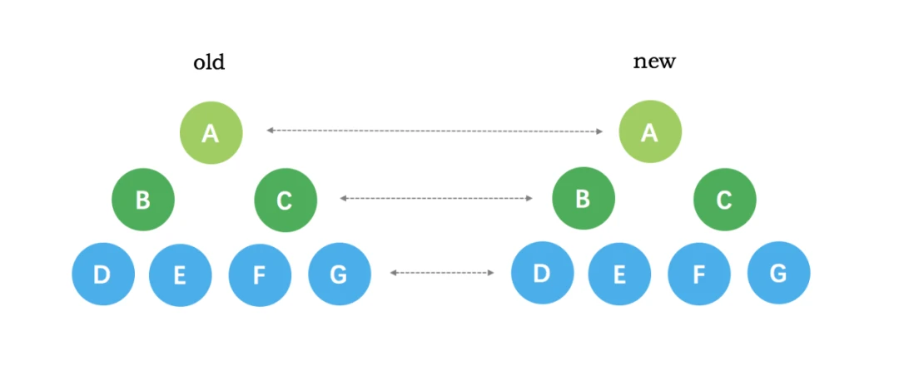
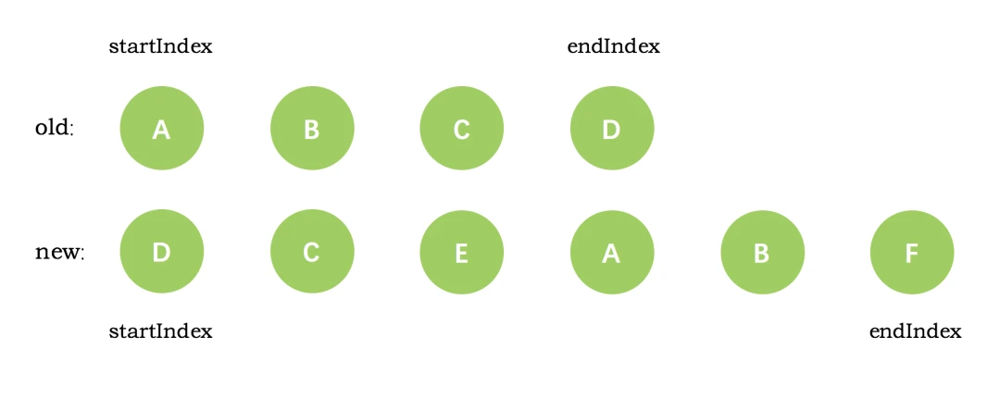

## Diff算法实现原理

### vue2 的 diff 算法实现原理是
`同层比较；双端比较；在比较过程中，循环向中间靠拢`。 

1. 同层比较，只会在同层比较，不会跨层比较。 

2. 双端比较，在比较过程中，循环向中间靠拢 

- 同时从新旧节点的头尾开始比较
- 如果头部或者尾部的节点相同，则复用节点，指针向中间靠拢。
- 如果头部或者尾部的节点不同，则尝试在旧节点中找到与新节点相同的节点，如果找到则复用节点，指针向中间靠拢。找不到则删除旧节点，添加新节点。

3. `key`的作用
- 通过为每一个节点设置唯一的`key`，可以更准确的识别出那些节点可以复用，减少不必要的 DOM 操作，提高新能。

4. patch函数
diff 算法最终通过 `patch`函数将差异应用到真实的 DOM 中。它的参数为（oldVnode, vnode, hydrating, removeOnly），作用如下：
- 没有新的节点，则直接触发旧节点的 destroy钩子函数，删除旧节点。
- 没有旧节点，说明是页面新建，则直接触发新节点的 create 钩子函数，创建新节点。
- 新节点和旧节点相同，通过 sameVnode 函数判断，如果相同则触发 patchVnode 函数，进行精细化比较。
- 新节点和旧节点不同，则根据新节点的类型创建对应的 DOM 节点，并删除旧节点。
- patchVnode 函数的作用，是对新旧节点的子节点进行 diff 比较和更新。

### vue3 的 diff 算法的优化
1. 静态提升：在编译阶段，将静态内容提升到渲染函数外部，避免每次更新是重复生成静态节点的开销，以及比较节点时，不需要比较静态节点。
2. PatchFlag，动态标记：为动态的节点打上标记，这使得在更新是可以直接定位到需要更新的节点，无需遍历整个节点树。
3. 缓存事件处理函数：在编译阶段，将事件处理函数缓存起来，避免每次更新时重新生成事件处理函数。
4. Fragments：支持多个根节点的组件，使得在更新时，只需要更新根节点，无需遍历整个节点树。
5. Block：将多个节点打包成一个块，使得在更新时，只需要更新块内的节点，无需遍历整个节点树。
6. 优化 diff 算法：使用最长递增子序列算法，减少了DOM移动操作。